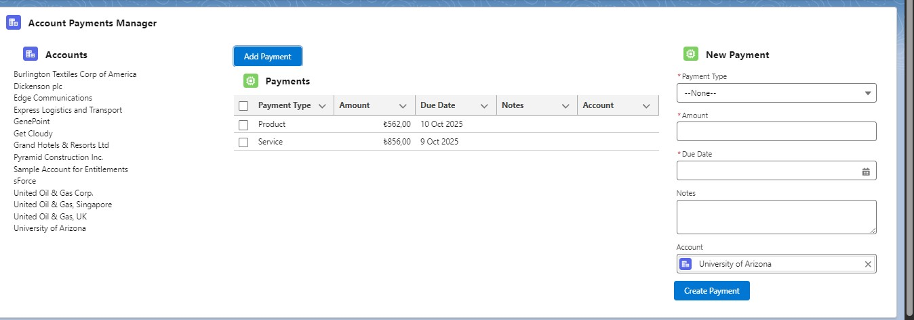
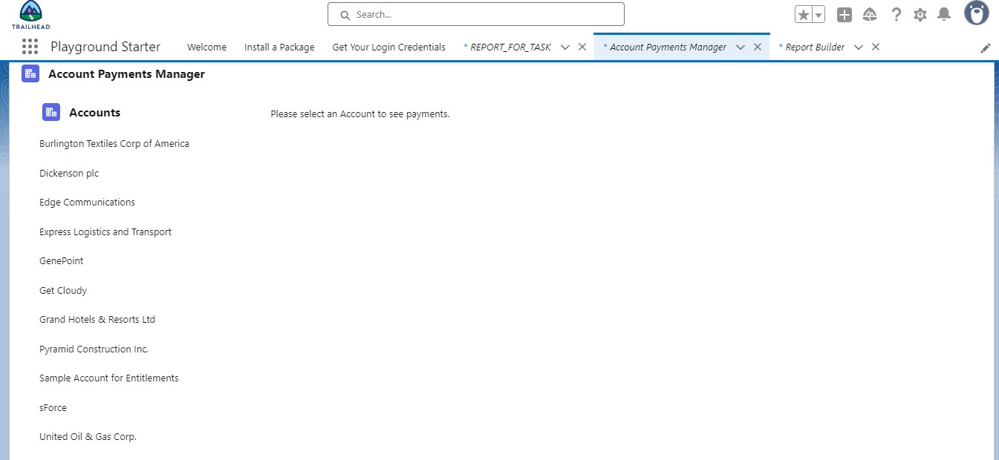
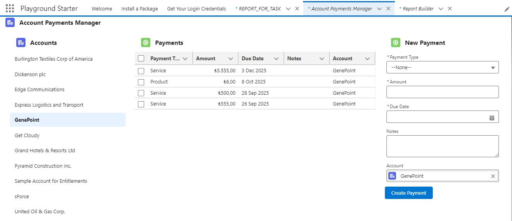
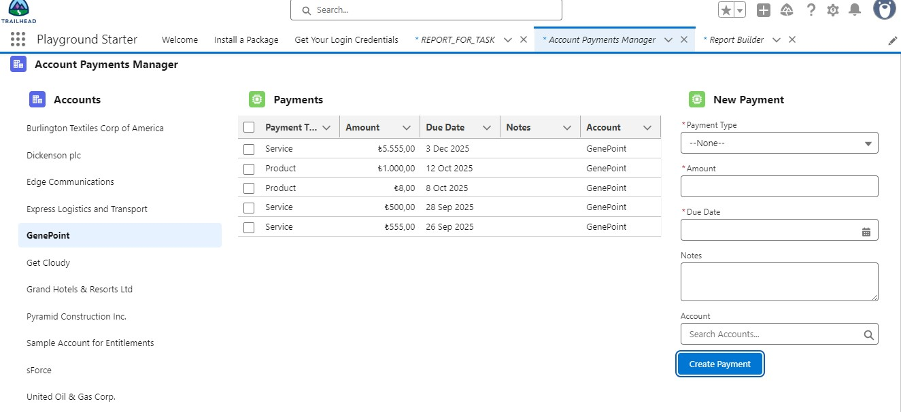
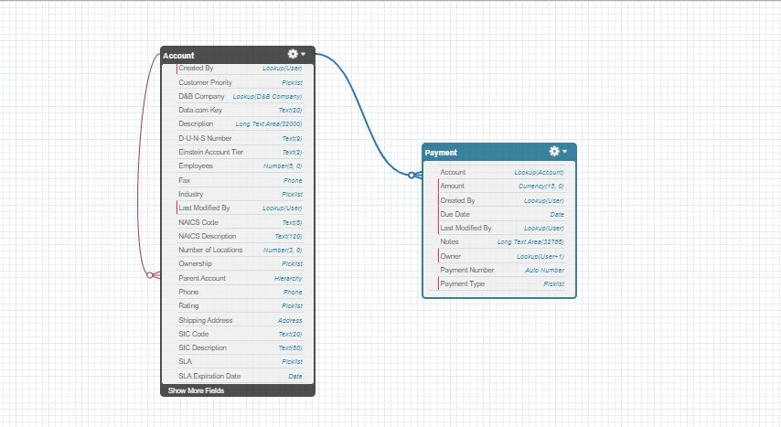
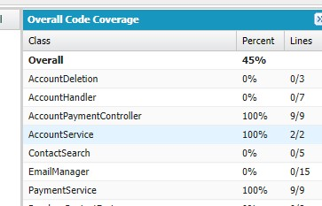
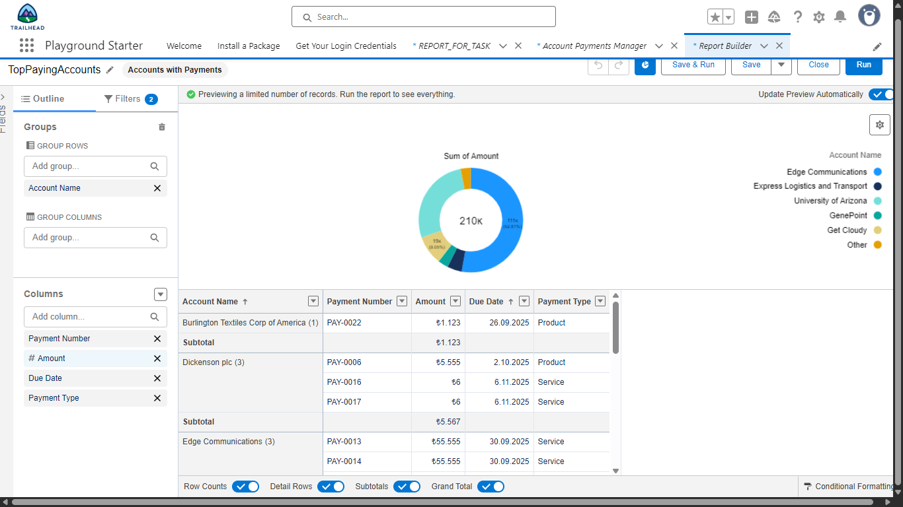
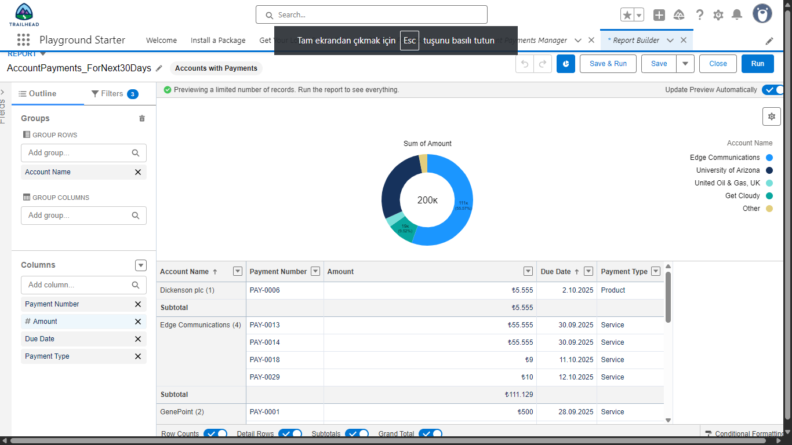
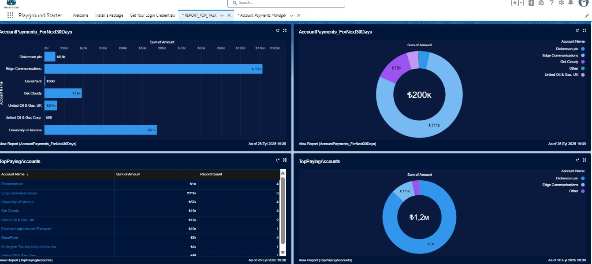

# 🔹 Account Payments LWC Project

This project was developed as part of a technical assessment. It demonstrates the use of **Lightning Web Components (LWC)**, **Apex controllers**, **custom Salesforce objects**, **reports**, and **dashboards**.

---

## 📌 Features

- Custom object **Payment__c** linked to **Account** via Lookup relationship.  
- **AccountPayments** LWC with 3-panel layout:
  - **Left**: List of Accounts  
  - **Middle**: Related Payments in a datatable  
  - **Right**: Form to create a new Payment  
- Real-time refresh: When a new Payment is created, the payment list updates automatically.  
- Validation rule to ensure **Due Date is always in the future**.  
- Test classes with **80%+ code coverage**.  
- Reports and Dashboard to visualize Payments.  

---

### Project Screenshots

#### 1. Initial State (No Account Selected)

#### 2. Account Selected

#### 3. After Creating a Payment

---

## 🗂️ Object Schema

Payment__c fields:

| Field Name       | Type       | Notes                                |
|------------------|-----------|--------------------------------------|
| Payment_Type__c  | Picklist  | Values: Service, Product, Other      |
| Amount__c        | Currency  | Required                             |
| Due_Date__c      | Date      | Required, must be in the future      |
| Notes__c         | Long Text | Optional                             |
| Account__c       | Lookup    | Relationship to Account              |

---

📷 **Schema Builder Screenshot:**  

---

## 🔗 Relationship Choice

I selected **Lookup Relationship** (instead of Master-Detail).  
- If an Account is deleted, we may want to keep the Payment records for auditing.  
- Lookup gives more flexibility compared to Master-Detail.  

---

## 🧪 Test Coverage

We implemented unit tests for all Apex classes:  
- `AccountService_Test`  
- `PaymentService_Test`  
- `AccountPaymentController_Test`  

📷 **Overall Code Coverage:**  

**Result:** ~85% overall coverage.

--- 

### Top Paying Accounts (All Time)
This report shows Accounts grouped by SUM(Amount), sorted by highest total payments.

### Payments This Month Report
This report shows all payments due in the current month, grouped by Account.

### Payments Overview Dashboard
Includes a donut chart (Top Accounts) and a bar chart (Payments due this month).

---
## 👤 Author

**Derya Yıldırım**

📎 [Trailhead Profile (Trailblazer.me)](https://trailblazer.me/id/deryayildirim) 